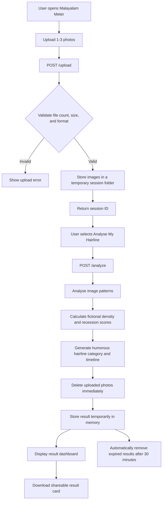

# കഷണ്ടി meter 🎯


## Basic Details
### Team Name: Overkill


### Team Members
-Devika G Nair  - Govt. Model Engineering College, Thrikkakkara

### Project Description
**Bald or Not** is a fun AI-powered web application that predicts how many years a person has left before they might go bald, based on an uploaded photo. Built purely for entertainment, it uses computer vision to turn an unnecessary question into an unnecessarily serious prediction. 😭


### The Problem (that doesn't exist)
Have you ever looked at a photo and thought:

“But exactly how many years do I have left before I go bald?”

Absolutely nobody asked for this information, but we decided to solve it anyway. Humans already have enough things to worry about, so we built an AI that gives you one more completely unnecessary prediction.

### The Solution (that nobody asked for)
Upload a photo, and our highly questionable AI analyzes your face and hair to predict how many years you have until baldness potentially strikes.

Is it medically accurate? No.
Is it scientifically reliable? Also no.
Is it unnecessarily entertaining? Absolutely.

The project uses computer vision to detect a face from the uploaded image and then generates a completely fun, randomized baldness prediction. The result is accompanied by a dramatic message because apparently just showing a number wasn't chaotic enough.

## Technical Details
### Technologies/Components Used
For Software:
Languages used: Python, JavaScript, HTML, CSS
Framework used: Flask
Libraries used:
      OpenCV (cv2)
      NumPy
      MediaPipe
      Flask
Tools used:
      GitHub
      VS Code
      Python Virtual Environment


### Implementation
For Software:
# Installation
git clone https://github.com/devika038/useless_project_temp.git
cd useless_project_temp
python -m venv venv

# Run
python app.py

````markdown
### Project Documentation

#### For Software:

The project follows a simple client-server architecture:

```text
useless_project_temp/
│
├── static/
│   ├── style.css       # Styling and animations
│   └── script.js       # Frontend interactions
│
├── templates/
│   └── index.html      # Main user interface
│
├── app.py              # Flask backend and image processing
├── requirements.txt    # Python dependencies
└── README.md           # Project documentation
````

**Workflow:**

1. User uploads an image through the web interface.
2. The image is sent to the Flask backend.
3. OpenCV and MediaPipe process the uploaded image.
4. The system analyzes the detected facial features.
5. A fun baldness prediction is generated.
6. The prediction is displayed on the frontend.

```
```


# Screenshots (Add at least 3)

The Malayalam Meter home screen invites users to upload 1–3 photos for a playful, fictional hairline analysis.


Users can drag and drop a front-facing photo or browse files, with guidance for clearer analysis.


After selecting a photo, users can review it, remove it, clear all photos, or begin the hairline analysis.


A humorous loading state simulates the app’s fictional hairline analysis process.


The results screen presents the “Chrome Dome” status, humorous commentary, density and recession scores, and a fictional confidence meter.


Downloadable result card
A shareable Malayalam Meter result card summarizing the fictional “Chrome Dome” verdict, estimated baldness deadline, density score, and recession score.

# Diagrams
# Diagrams


Workflow architecture: Users upload up to three photos, which are validated and analysed using visible image patterns. Malayalam Meter generates a fictional entertainment-only result, deletes the uploaded photos immediately after analysis, displays the result dashboard, and automatically removes temporary results after 30 minutes.


### Project Demo
# Video

(https://drive.google.com/file/d/1XnTEd_LnNWx38BELoA4GLftP036wFj3q/view?usp=sharing)
The video demonstrates the complete Malayalam Meter experience: selecting and uploading a photo, starting the fictional hairline analysis, viewing the animated analysis screen, and receiving a humorous result with a hairline category, estimated baldness timeline, density score, recession score, and downloadable result card. It also highlights that the project is made purely for entertainment and does not provide medical advice.


## Team Contributions
- Thaniya Haris - partner in crime

---
Made with ❤️ at TinkerHub Useless Projects 


